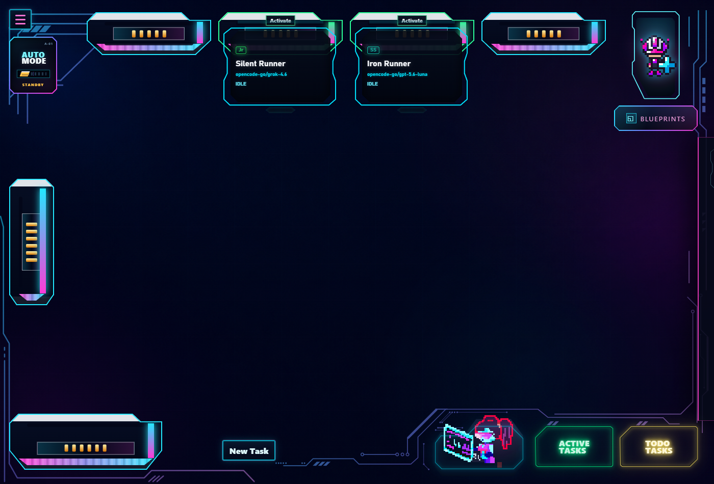
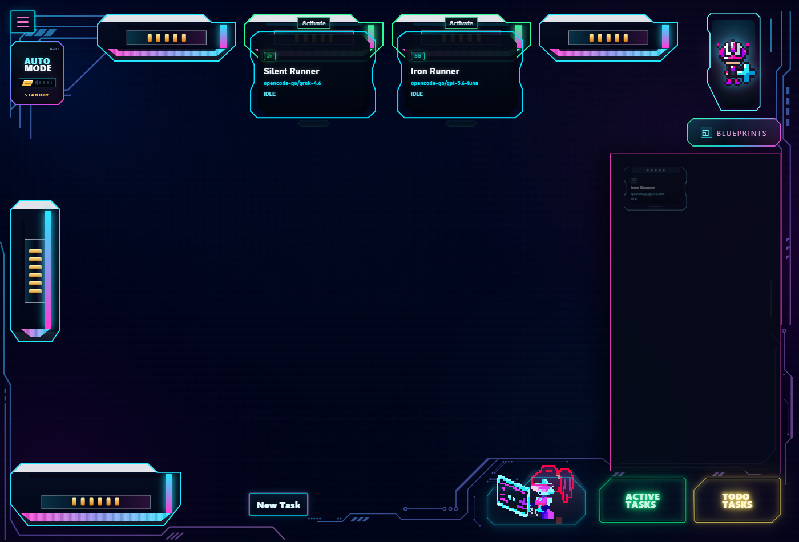

# TinyAgentOffice

TinyAgentOffice is a Windows-first desktop dashboard for coordinating multiple coding agents inside a project. Agents live in visual cartridges, connect to role-aware sockets, share a structured task board, and retain project-local memory between sessions.

> [!IMPORTANT]
> **v0.1.0 is an early release.** A portable Windows build is available from [GitHub Releases](https://github.com/Ninquiet/TinyAgentOffice/releases), and the project can also be run from source. The current runtime integration targets [OpenCode](https://opencode.ai/en/docs).



## What it does

- Runs a local Electron and React office dashboard.
- Organizes agents into Project Manager, Senior Pro, Semi Senior, and Junior roles.
- Coordinates task claiming, prerequisites, reviews, reports, and user decisions through a SQLite-backed runtime.
- Launches and monitors OpenCode sessions from configurable agent cartridges.
- Stores private agent memory per cartridge and per project.
- Provides a reusable, draggable blueprint tray for agent configurations.
- Surfaces agent questions, notices, and usage-limit events through the secretary inbox.
- Includes automated scheduling through Auto Mode and a daemon fleet configuration.



## Requirements

- Windows 10 or Windows 11.
- Node.js 22.13 or newer and npm. The portable app also needs `node` available on `PATH` for its local coordination backend.
- The OpenCode CLI installed and configured with the model providers you want to use.

Install OpenCode through npm:

```powershell
npm install -g opencode-ai
```

Then run `opencode` once and connect your provider before launching agents from TinyAgentOffice. See the [official OpenCode setup guide](https://opencode.ai/en/docs) for other installation methods.

## Quick start

Download the portable Windows executable from [GitHub Releases](https://github.com/Ninquiet/TinyAgentOffice/releases), or run TinyAgentOffice from source:

```powershell
git clone https://github.com/Ninquiet/TinyAgentOffice.git
cd TinyAgentOffice
npm install
npm run start:desktop:dev
```

When the project chooser appears, select the project you want the office to coordinate. TinyAgentOffice creates a `.tiny-agent-office` directory inside that project for its instructions, agent memories, task database, and local configuration.

### Production-style local run

Build the React application before starting Electron without Vite:

```powershell
npm run build:web
npm run start:desktop
```

## Useful commands

| Command | Purpose |
| --- | --- |
| `npm run start:desktop:dev` | Start the backend, Vite, and Electron with live reload. |
| `npm run build:web` | Build the dashboard into `app/dist`. |
| `npm run start:desktop` | Start Electron using the built dashboard. |
| `npm run dist:win` | Build the portable Windows executable into the ignored `release/` directory. |
| `npm run init:project -- --project "C:\path\to\project"` | Initialize TinyAgentOffice files in a project. |
| `npm run check` | Run TypeScript and the fast regression suite. |
| `npm run check:all` | Run the fast suite plus end-to-end scenarios. |

## How project data is stored

TinyAgentOffice keeps operational data local:

- `<project>/.tiny-agent-office/coordination/runtime.db` is the coordination source of truth.
- `<project>/.tiny-agent-office/agent-memory/` contains cartridge-specific project memory.
- `runtime/` stores machine-local application state such as recent projects and development process IDs.

These locations are excluded from this repository. Do not commit a coordinated project's `.tiny-agent-office` directory unless you intentionally want to share its instructions or history.

OpenCode and the model providers configured in OpenCode have their own data and privacy policies. Review them before using TinyAgentOffice with private source code.

## Current limitations

- The current desktop and terminal-window integration is Windows-first.
- The Windows build is currently portable and unsigned, so Windows may display a SmartScreen warning.
- OpenCode is the only implemented agent runtime.
- The interface is optimized for a desktop window of at least `1250 × 950`.
- This is an early release, so back up important projects before experimenting with automated agent workflows.

## Project structure

```text
app/        React dashboard and themes
desktop/    Electron shell and development launcher
system/     Coordination runtime, dashboard backend, OpenCode integration, and tests
docs/       Public documentation and screenshots
```

## Contributing

Bug reports and focused pull requests are welcome. Before opening a pull request:

```powershell
npm install
npm run check:all
```

Please avoid committing API keys, provider credentials, runtime databases, project-local agent memories, logs, or screenshots containing private project information.

## Release status

This repository captures the first usable TinyAgentOffice milestone: **v0.1.0**. Future ideas will be developed incrementally instead of delaying this initial release.
